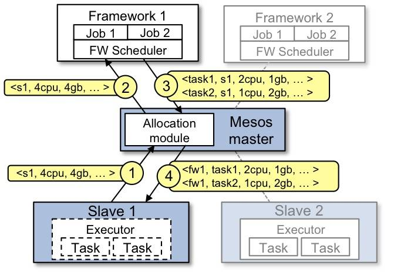

# MesOS

- [Mesos 分布式架构](#mesos-分布式架构)
- [Mesos配置](#mesos配置)
- [部署(不支持GPU)](#部署不支持gpu)
  - [拉取镜像](#拉取镜像)
  - [启动ZooKeeper容器](#启动zookeeper容器)
  - [启动Mesos Master](#启动mesos-master)
    - [高可用](#高可用)
  - [启动Marathon](#启动marathon)
  - [启动Mesos Slave](#启动mesos-slave)
    - [关于`/var/run/docker.sock`](#关于varrundockersock)
- [部署支持GPU方案](#部署支持gpu方案)
  - [启动 Mesos Master](#启动-mesos-master)
  - [启动 Marathon](#启动-marathon)
    - [根据GPU有不同的集群方案](#根据gpu有不同的集群方案)
  - [启动 Mesos Slave](#启动-mesos-slave)
- [framework 开发接口](#framework-开发接口)
  - [SUBSCRIBE](#subscribe)
- [mesos 调度流程](#mesos-调度流程)
- [Marathon](#marathon)
- [负载均衡](#负载均衡)

Apache Mesos系统是一套资源管理调度集群系统

- Marathon是一个生产级的容器编排平台，用于中间层的数据中心操作系统(DC/OS)和Apache Mesos.为部署提供提供REST API服务，有授权和SSL、配置约束，通过HAProxy实现服务发现和负载平衡。
- Apache Mesos 是一款基于多资源（内存、CPU、磁盘、端口等）调度的开源群集管理套件，能时容错和分布式关系系统更加容易使用。
Apache Mesos 采用了Master/Slave 结构来简化设计，将Master 做的尽可能轻量级别仅保存了各种计算框架（Framework）和Mesos Slace 的状态详细。Mesos Master 充当与全局资源调度角色，采用某种策略算法将摸一个Slace上的空闲资源来分配给某一个Framewok 而且种Framework 则是通过自己的调度器向Master注册进行接入。
- zookeeper 是一个开远市分布式应用协调服务可以为分布式应用提一致性服务，提供的功能包裹：配置维护，域名服务，分布式同步。组服务等。
zookeeper 的目标就是讲复杂易出错的关键服务进行分装，提供给用户使用性能高效功效稳定简单易用的操作系统

## Mesos 分布式架构

Mesos 从底层系统抽象化CPU 、内存、磁盘资源，将多个服务器展现成一个大机器。

- masters  
  Mesos master 的职责是管理集群中在每台机器上运行的Mesos slave 守护进程。通过 ZooKeeper 和master 之间协调哪个节点是主master ，哪些节点作为备用存在，它们将在主master 离线时接管服务。  
  Mesos 集群至少要求有一个master 节点。在生产环境为了保证高可用性，推荐采用三个甚至更多的master 节点。
- slaves  
  在集群中负责执行 framework 任务的服务器,通过访问 ZooKeeper 来确定主 master 节点，将CPU、内存、存储资源以资源供给的形式宣告给主master。
- framework  
  负责在集群上调度与执行任务，由两个组件组成：调度器与执行器。

## Mesos配置

- [Mesos配置参数](http://mesos.apache.org/documentation/latest/configuration/),docker 启动环境变量以 `MESOS_`开头，加上参数名大写  
- [Marathon配置参数](http://mesosphere.github.io/marathon/docs/command-line-flags.html)，docker 启动环境变量为`MARATHON_`+所有大写字母中的选项名称

## 部署(不支持GPU)

### 拉取镜像

```sh
docker pull zookeeper
docker pull mesosphere/mesos-master:1.6.2
docker pull mesosphere/mesos-slave:1.6.2
docker pull mesosphere/marathon:v1.10.19
```

### 启动ZooKeeper容器

```sh
docker run -d \
--name zookeeper \
--restart always \
-p 2181:2181 \
-p 2888:2888 \
-p 3888:3888 \
zookeeper
```

### 启动Mesos Master

```sh
docker run -d --net=host \
  --name mesos_master \
  -e MESOS_HOSTNAME=192.168.1.118 \
  -e MESOS_IP=192.168.1.118 \
  -e MESOS_PORT=5050 \
  -e MESOS_ZK=zk://192.168.1.118:2181/mesos \
  -e MESOS_QUORUM=1 \
  -e MESOS_CLUSTER=master_118 \
  -e MESOS_REGISTRY=replicated_log \
  -e MESOS_LOG_DIR=/var/log/mesos \
  -e MESOS_WORK_DIR=/var/tmp/mesos \
  -v "/mesos/log:/var/log/mesos" \
  -v "/mesos/tmp:/var/tmp/mesos" \
  --restart always \
  mesosphere/mesos-master:1.6.2
```

> 参数说明(加粗为必选参数)  
  **`MESOS_WORK_DIR`** Registry 中持久化信息存储的位置。  
  **`MESOS_QUORUM`** 参与master选举的最少节点数，需要设置为masters总数量的一半以上，  
  **`MESOS_ZK`** ZooKeeper 的 URL地址 （用于在masters中做领导选举）  
  `MESOS_REGISTRY` 注册表持久化策略: in_memory内存 / replicated_log本地  
  `MESOS_HOSTNAME` 主机地址，设置为本机ip  
  `MESOS_ROLES` 其 frameworks 在这个集群中可能归属于的用逗号分离的一系列指派的角色。  
  `MESOS_WEIGHTS` 逗号分割的角色/权重列表，成对表单 role=weight,role=weight。 weights是用来表达优先级。  
  `MESOS_CLUSTER` 集群别名，会在 WebUI上显示。  

#### 高可用

`--quorum=N`

| Masters Quorum | Size Failure | Tolerance |
| -------------- | ------------ | --------- |
| 1              | 1            | 0         |
| 3              | 2            | 1         |
| 5              | 3            | 2         |
| …              | …            | …         |
| 2N - 1         | N            | N - 1     |

为了保证高可用性，最少建议运行3个Master,增加（减少）节点后，需要重新配置`quorum`参数

### 启动Marathon
  
```sh
docker run -p 8080:8080 -d \
  --name mesos_marathon \
  --restart always \
  -e MARATHON_MASTER=zk://192.168.1.118:2181/mesos \
  -e MARATHON_ZK=zk://192.168.1.118:2181/marathon \
  -e MARATHON_HOSTNAME=192.168.1.118 \
  mesosphere/marathon:v1.10.19
```

### 启动Mesos Slave

```sh
docker run -d --net=host --privileged \
  --pid=host \
  --name mesos_slave \
  --restart always \
  -e MESOS_SYSTEMD_ENABLE_SUPPORT=false \
  -e MESOS_PORT=5051 \
  -e MESOS_HOSTNAME=192.168.1.90 \
  -e MESOS_IP=192.168.1.90 \
  -e MESOS_MASTER=zk://192.168.1.118:2181/mesos \
  -e MESOS_SWITCH_USER=0 \
  -e MESOS_CONTAINERIZERS=docker,mesos \
  -e MESOS_LOG_DIR=/var/log/mesos \
  -e MESOS_WORK_DIR=/var/tmp/mesos \
  -e MESOS_ISOLATION=cgroups/cpu,cgroups/mem \
  -v "/mesos/slave/log:/var/log/mesos" \
  -v "/mesos/slave/tmp:/var/tmp/mesos" \
  -v /var/run/docker.sock:/var/run/docker.sock \
  -v /sys/fs/cgroup:/sys/fs/cgroup \
  mesosphere/mesos-slave:1.6.2
```

> 注意：
 如果没有添加 `-e MESOS_SYSTEMD_ENABLE_SUPPORT=false` ，则会报错：
“Failed to initialize systemd: Failed to locate systemd runtime directory: /run/systemd/system”  
> `--pid=host` 可以让容器内访问宿主机进程

- 环境变量
  - `MESOS_CONTAINERIZERS`:由逗号分隔的容器化实现方式列表。可选项有 `mesos`, `external` 和 `docker` (on Linux). 排列的顺序就是容器化过程中尝试的顺序。 （默认：mesos）  
    `mesos`  的任务是通过cgroups 隔离工作负载，监控资源消耗的情况， `docker` 则调用了Docker 容器的运行时，并且让你在Mesos 集群当中启动你之前制作好的镜像。
  - `MESOS_ISOLATION`: 所采用的隔离机制，如：`posix/cpu,posix/mem` 或 `cgroups/cpu,cgroups/mem` 或 `network/port_mapping`（通过 `--with-network-isolator` 标记来开启） 或 `external` 或者通过`--modules`标记替换成另一个隔离模块。 注意：这个标记仅用于 Mesos 容器化器。（默认：`posix/cpu,posix/mem`）
    - 设置启用 Nvidia GPU 支持：`filesystem/linux,cgroups/devices,gpu/nvidia`，默认情况下，将自动发现代理上的所有GPU，并将其作为资源提供的一部分发送给Mesos主服务器。
  - `MESOS_NVIDIA_GPU_DEVICES`: 设置使用部分GPU，

#### 关于`/var/run/docker.sock`

`/var/run/docker.sock` 是docker 的socket 连接， 用于和 Docker Daemon 服务通信，挂载这个文件后，拥有 docker 客户端的容器在内部可和宿主机 docker 服务交互，达到和宿主机命令相同效果，构建运行的镜像也是运行的宿主机上

## 部署支持GPU方案

### 启动 Mesos Master

```sh
docker run -d --net=host \
  --name mesos_master \
  -e MESOS_HOSTNAME=192.168.1.118 \
  -e MESOS_IP=192.168.1.118 \
  -e MESOS_PORT=5050 \
  -e MESOS_ZK=zk://192.168.1.118:2181/mesos \
  -e MESOS_QUORUM=1 \
  -e MESOS_CLUSTER=master_118 \
  -e MESOS_FILTER_GPU_RESOURCES \
  -e MESOS_LOG_DIR=/var/log/mesos \
  -e MESOS_WORK_DIR=/var/tmp/mesos \
  -v "/mesos/log:/var/log/mesos" \
  -v "/mesos/tmp:/var/tmp/mesos" \
  --restart always \
  mesosphere/mesos-master:1.6.2
```

> 以下参数按需求二选一  
  **`MESOS_FILTER_GPU_RESOURCES`** 仅将包含GPU的节点的邀约发送到选择加入GPU资源的框架  
  **`MESOS_NO-FILTER_GPU_RESOURCES`** 将包含GPU的节点的报价发送到所有框架，而与GPU选择启用状态无关。

### 启动 Marathon
  
```sh
docker run -p 8080:8080 -d \
  --name mesos_marathon \
  --restart always \
  -e MARATHON_MASTER=zk://192.168.1.118:2181/mesos \
  -e MARATHON_ZK=zk://192.168.1.118:2181/marathon \
  -e MARATHON_HOSTNAME=192.168.1.118 \
  -e MARATHON_ENABLE_FEATURES=gpu_resources \
  -e MARATHON_GPU_SCHEDULING_BEHAVIOR=restricted \
  mesosphere/marathon:v1.10.19
```

- **MARATHON_ENABLE_FEATURES**： 告诉Mesos应该为Marathon提供GPU资源。
- **MARATHON_GPU_SCHEDULING_BEHAVIOR**： 定义应如何处理提供的GPU资源。可能的设置：
  - unrestricted ： 无论包含GPU的报价如何，都会启动非GPU任务。
  - restricted（默认）-非GPU任务将拒绝包含GPU的报价。

#### 根据GPU有不同的集群方案

[marathon中的GPU调度概述](http://mesosphere.github.io/marathon/docs/preferential-gpu-scheduling.html)

- （1）没有GPU

```sh
mesos-master ...
marathon ...
```

- （2a）稀缺的GPU，Marathon将直接启动GPU任务

```sh
mesos-master --filter_gpu_resources ...
marathon --enable_features gpu_resources --gpu_scheduling_behavior restricted ...
```

- （2b）稀缺的GPU，Marathon **无法**启动GPU任务

```sh
mesos-master --filter_gpu_resources ...
marathon ...
```

- （3a）丰富的GPU，Marathon将直接启动GPU任务

```sh
mesos-master --no-filter_gpu_resources ...
marathon --enable_features gpu_resources --gpu_scheduling_behavior unrestricted ...
```

- （3b）丰富的GPU，Marathon **不会**启动GPU任务

```sh
mesos-master --no-filter_gpu_resources ...
marathon ...
```

### 启动 Mesos Slave

```sh
# 启用GPU
docker run -d --net=host --privileged \
  --pid=host \
  --name mesos_slave \
  --runtime=nvidia \
  -e MESOS_SYSTEMD_ENABLE_SUPPORT=false \
  -e MESOS_PORT=5051 \
  -e MESOS_HOSTNAME=192.168.1.74 \
  -e MESOS_IP=192.168.1.74 \
  -e MESOS_MASTER=zk://192.168.1.118:2181/mesos \
  -e MESOS_SWITCH_USER=0 \
  -e MESOS_CONTAINERIZERS=docker,mesos \
  -e MESOS_LOG_DIR=/var/log/mesos \
  -e MESOS_WORK_DIR=/var/tmp/mesos \
  -e MESOS_IMAGE_PROVIDERS=docker \
  -e MESOS_ISOLATION=filesystem/linux,cgroups/devices,cgroups/cpu,cgroups/mem,gpu/nvidia,docker/runtime \
  -v "/mesos/slave/log:/var/log/mesos" \
  -v "/mesos/slave/tmp:/var/tmp/mesos" \
  -v "/mesos/slave/docker:/tmp/mesos/store/docker" \
  -v /var/run/docker.sock:/var/run/docker.sock \
  -v /sys/fs/cgroup:/sys/fs/cgroup \
  dockerhub.bmi:5000/mesos-slave:cuda-8.0
```

- 该镜像是基于`nvidia/cuda:8.0-runtime`和`mesosphere/mesos-master:1.6.2`的合并版本，[dockerfile](./Dockerfile),使用时须[搭建docker-nvidia 环境](http://gitlab.bmi/ylrc/vdms-architecture/blob/master/doker-nvidia.md)
- [mesos 支持 GPU](http://mesos.apache.org/documentation/latest/gpu-support/#nvidia-gpu-support) 需要声明隔离器（isolation）： `filesystem/linux,cgroups/devices,gpu/nvidia`，
- mesos 运行 GPU 任务只能用 Mesos 容器，mesos 容器可以支持 docker 镜像，需要添加隔离器 `docker/runtime`， 并且配置`MESOS_IMAGE_PROVIDERS=docker`

## framework 开发接口

### SUBSCRIBE

## mesos 调度流程



`TODO`

```mermaid
sequenceDiagram
  participant Slave
  participant Master
  participant framework
  Slave ->> Master: 注册并上报资源信息
  framework ->> Master: 注册并发送 Subscribe 连接到mesos
  Master ->> framework: 触发 Offer Event 描述当前可用资源
  Note left of framework: 根据自己需要资源情况选择接受还是拒绝
  alt 拒绝 Offer
    framework ->> Master: 发送 DECLINE 请求
  else 接受 Offer
    framework ->> Master: 发送 ACCEPT 请求
    Master ->> Slave: 执行 Task 并触发 LAUNCH 事件
    Slave ->> framework: Task 状态更新, 发送 UPDATE 事件
    framework -->> Slave: 更新状态，并回复 ACKNOWLEDGE 确认状态更新
  end
```

## Marathon

该框架只能启动长期任务，例如服务器

若要运行单次任务，可以采用[自杀法（the suicide method）](https://github.com/mesosphere/marathon/issues/344#issuecomment-86697361)

## 负载均衡

`TODO` 暂未测试

[Marathon-lb](https://cloud.tencent.com/developer/article/1025983)既是一个服务发现工具，也是负载均衡工具，它集成了haproxy，自动获取各个app的信息，为每一组app生成haproxy配置，通过servicePort或者web虚拟主机提供服务。  
1）要使用marathonn-lb，每组app必须设置HAPROXY_GROUP标签。  
2）Marathon-lb运行时绑定在各组app定义的服务端口（servicePort，如果app不定义servicePort，marathon会随机分配端口号）上，可以通过marathon-lb所在节点的相关服务端口访问各组app。  
比如说：marathon-lb部署在slave2，test-app 部署在slave1，test-app 的servicePort是10004，那么可以在slave2的10004端口访问到test-app提供的服务。  
3）由于servicePort非80、443端口（80、443端口已被marathon-lb中的 haproxy独占），对于web服务来说不太方便，可以使用 haproxy虚拟主机解决这个问题：  
在提供web服务的app配置里增加HAPROXY_{n}_VHOST（WEB虚拟主机）标签，marathon-lb会自动把这组app的WEB集群服务发布在marathon-lb所在节点的80和443端口上，用户设置DNS后通过虚拟主机名来访问。  

Marathon-lb基于HAProxy，给基于TCP和HTTP协议的应用提供代理和负载均衡功能，此外还提供诸如SSL支持，HTTP压缩，健康检查，Lua脚本等。Marathon-lb订阅Marathon的事件总线，实时更新HAProxy的配置，并重载应用。

```json
{
  "id": "marathon-lb",
  "instances": 1,
  "constraints": [["hostname", "UNIQUE"]],
  "container": {
    "type": "DOCKER",
    "docker": {
      "image": "docker.io/mesosphere/marathon-lb",
      "privileged": true,
      "network": "HOST"
      }
  },
  "args": ["sse", "-m","http://182.48.115.233:8080","--group", "external"]
}
```

- 注意：
  - 1）network 采用的是`HOST`，与宿主机共享namespace
  - 2）args 后面http配置的ip是marathon的ip；也可以将多个master的ip都配置上

    ```json
      "args": ["sse", "-m","http://master1_ip:8080", "-m","http://master2_ip:8080", "-m","http://master3_ip:8080","--group", "external"]
    ```

  - 3）注意group 后面的`external`参数，可以定义多个不同的”group”（即不同的marathon-lb），针对不同的应用可以绑定到不同的”group”；

启动容器须添加Labels

```json
{
  "id":"/nginx",
  "cpus": 0.5,
  "mem": 100,
  "disk": 0,
  "gpus": 0,
  "instances": 1,
  "container": {
    "type": "DOCKER",
    "docker": {
      "forcePullImage": false,
      "image": "nginx",
      "parameters": [],
      "privileged": true
    },
    "portMappings": [
      {
        "containerPort": 80,
        "hostPort": 0,
        "labels": {},
        "protocol": "tcp",
        "servicePort": 80
      }
    ]
  },
  "networks": [
    {
      "mode": "container/bridge"
    }
  ],
  "labels": {
      "HAPROXY_GROUP": "external",
      "HAPROXY_0_VHOST": "nginx.marathon.mesos"
    },
}
```

- 1）一定要加上`HAPROXY_GROUP`标签，它填写的是`marathon-lb`创建时定义的组名（如上）
- 2）`HAPROXY_0_VHOST`是标签名，对于web服务可以加上 VHOST 标签，让`marathon-lb`设置WEB虚拟主机；  
   这个标签名字可以随便定义，目的是为了便于区别应用容器。一般可以用业务域名来描述标签。  
- 3）"instances"表示应用的实例数，一般默认是1，如果写成n，说明创建n个应用。  
- 4）containerPort为80,是指容器内的端口。  
- 5）hostPort是当前主机映射到contenterPort的端口，如果hostPort为0的话,则说明是随机的。  
- 6）serverPort是marathon-lb需要配置的haproxy代理暴露的端口,这里设置为80，说明访问marathon-lb机器的80端口就可为访问这个应用容器的80端口。  
