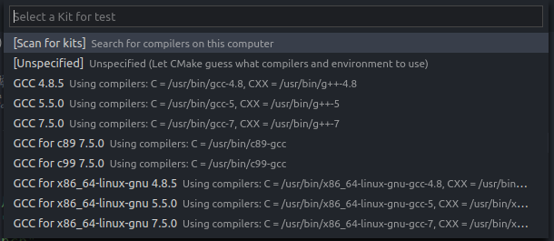
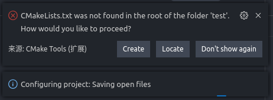

# VSCode C++ 环境配置

## 基础要求

系统装有 `gcc/g++` 和 `cmake` 以及 `VSCode`

## 安装插件

- `C/C++` (c/c++ 语法)
- `C++ Intellisense` (代码格式化)
- `CMake` (cmake 语法高亮)
- `CMake Tools`

## 添加配置

### CMake

按快捷键 `Ctrl+Shift+P` 调出控制台， 输入 `cmake` ，选择`CMake:Configure` 或者 `CMake:Quick Start` 开始配置

1. 选择 gcc 编译工具版本

    

2. 根据提示创建 `CMakeLists.txt`， 选择 `Create`， 创建新文件， 选择`Locate` 打开已有文件

    

3. 若 2 选择`Create`, 则按提示创建文件，输入项目名称，选择输出类型，就会生成 `CMakeLists.txt` 文件

    
    

当状态栏出现如下图表时，则表明配置完成，可以选择 `Build` 尝试编译


#### CMakeLists.txt

该配置是使用`pkgconfig`编译成动态库， 如需其他格式，自行修改

```cmake
cmake_minimum_required(VERSION 3.0.0)
project(gbsip VERSION 0.1.0)

include(CTest)
enable_testing()

## there is two way to import 3Party Library, please choose one
### 1. import 3Party Library use pkgconfig
set(ENV{PKG_CONFIG_PATH} /home/xxx/exosip/lib/pkgconfig)
find_package(PkgConfig)
pkg_check_modules(SIP REQUIRED libeXosip2 libosip2 libosipparser2 libcares)
include_directories(${SIP_INCLUDE_DIRS})
link_directories(${SIP_LIBRARY_DIRS})

### 2. import 3Party Library use relative path
# include_directories(${PROJECT_SOURCE_DIR}/include)
# link_directories(${PROJECT_SOURCE_DIR}/lib/x64)

## set output directory
set(CMAKE_LIBRARY_OUTPUT_DIRECTORY  ${PROJECT_SOURCE_DIR}/build/out)

## The compilation output can be a library or an executable file
###> .so is dynamic library
add_library(gbsip SHARED gbsip.cpp)

###> .a is static library
# add_library(gbsip STATIC gbsip.cpp)

###> exe
# SET(CMAKE_CXX_FLAGS "${CMAKE_CXX_FLAGS} -std=c++0x")
# aux_source_directory(. SRC_LIST)
# add_executable(gbsip ${SRC_LIST})


## link thirdlib
target_link_libraries(gbsip ${SIP_LIBRARIES})
# target_link_libraries(gbsip libcares.so libosipparser2.so libosip2.so libeXosip2.so)

## ouput version, if output is `.so`, please open this
SET_TARGET_PROPERTIES(gbsip PROPERTIES VERSION 0.1.0 SOVERSION 0)


set(CPACK_PROJECT_NAME ${PROJECT_NAME})
set(CPACK_PROJECT_VERSION ${PROJECT_VERSION})
include(CPack)
```

### Debug

设置好 CMake 后，打开 `.cpp` 文件， 按快捷键 `Ctrl+Shift+D` 打开调试面板，点击 `运行和调试`, 根据系统情况选取不同的 `C++` ,如下图所示：


然后根据需要选择不同版本的编译器配置，会生成 `lunch.json` 和 `tasks.json`, 根据调试需求更改相应的参数


### C++ configure

按快捷键 `Ctrl+Shift+P` 调出控制台, 输入 `c++`，选择 `C/C++编辑配置` UI界面或者 JSON 格式进行配置，

```json
{
    "configurations": [
        {
            "name": "Linux",
            // add header file path
            "includePath": [
                "/usr/include",
                "/usr/local/include",
                "${workspaceFolder}/**",
                "${workspaceFolder}/include/exosip"
            ],
            "defines": [],
            // set search path
            "browse": {
                "path": [
                    "${workspaceFolder}/include/exosip",
                    "${workspaceFolder}"
                ],
                "limitSymbolsToIncludedHeaders": false
            },
            "compilerPath": "/usr/bin/gcc",
            "cStandard": "gnu11",
            "cppStandard": "gnu++11",
            "intelliSenseMode": "gcc-x64",
            "configurationProvider": "ms-vscode.cmake-tools"
        }
    ],
    "version": 4
}
```
